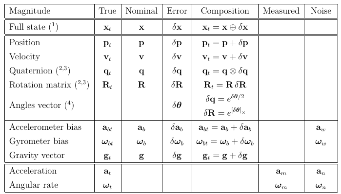

[TOC]

# ESKF

### ESKF优点

- 方向错误很小,有着和自由度相同的参数,这样避免了过参数化的问题.
- ESKF基本在原点进行处理,这样可以避免一些奇异和万向锁问题.
- 误差状态通常来说很小,这样能够保证所有的二阶乘积可以忽略不计.这就能让雅克比的计算量变小,计算的很快.一些雅克比甚至是恒定的.
- 误差变化很慢,所以我们修正误差能用一个很慢的速度.

### 大致流程

在误差状态滤波器中,我们通常有这几个值,称为真值,标称值和误差值.真值是标称值和误差的组合.ESKF的思想是将标称状态看做大信号(以非线性方式可积),将误差状态视为小信号(因此线性可积,适用于线性高斯滤波).

一方面,高频率IMU数据$u_m$被集成到标称状态$x$.这个标称状态没有考虑到噪声$w$和其他的一些误差.所以这个标称状态会累计误差.这些误差被集成到误差状态$\delta x$并且通过ESKF估计出来.这个误差状态包含所有的噪声和扰动.所以我们可以看出,误差状态由小信号组成,其推导函数由线性动态系统定义,这个推导矩阵由标称状态计算得出.在标称状态的积分同时,ESKF也会预测误差状态的高斯估计.这里只会预测,因为到目前为止我们没有其他测量能用于纠正这些估计.滤波器的矫正通常在IMU以外的数据到达时进行,比如GPS信息,视觉信息,这些信息通常能够观测到这些误差,并且速率比IMU的速率低得多.在此之后,错误状态的平均值被注入到标称状态,然后重置为零.错误状态的协方差矩阵会很方便的更新以反映这个重置,然后系统这样继续运行下去.

### 连续时间的系统运动

上图表示了在ESKF中的所有变量.有几个值得注意的点.

- 角速度$\omega$是定义为局部的标称四元数.这让我们能够直接使用陀螺仪测量的角速度$\omega_m$.
- 角速度误差$\delta \theta$也是定义为局部的标称四元数.有论文证明使用全局定义角度误差有更好的性质.

#### 运动真值

真值运动公式为:
$$
\begin{array} \dot{\mathbf{p}}_{t} &=\mathbf{v}_{t} \\ \dot{\mathbf{v}}_{t} &=\mathbf{a}_{t} \\ \dot{\mathbf{q}}_{t} &=\frac{1}{2} \mathbf{q}_{t}\otimes \omega_{t} \\ \dot{\mathbf{a}}_{b t} &=\mathbf{a}_{w} \\ \dot{\boldsymbol{\omega}}_{b t} &=\boldsymbol{\omega}_{w} \\ \dot{\mathbf{g}}_{t} &=0 \end{array}
$$
真值$a_t$和$\omega_t$由测量值算得:
$$
\begin{array} \mathbf{a}_{m} &=\mathbf{R}_{t}^{\top}\left(\mathbf{a}_{t}-\mathbf{g}_{t}\right)+\mathbf{a}_{b t}+\mathbf{a}_{n} \\ \boldsymbol{\omega}_{m} &=\boldsymbol{\omega}_{t}+\boldsymbol{\omega}_{b t}+\boldsymbol{\omega}_{n} \end{array}
$$
在这里的$\omega_m$中少了地球自转角速度,如果在比较高精度的IMU系统中,地球自转角速度是不能省略的.$\omega_{m}=\omega_{t}+\mathbf{R}_{t}^{\top} \omega_{\mathcal{E}}+\omega_{b t}+\omega_{n}$,$\omega_{\mathcal{E}}=15^{\circ} / \mathrm{h} \approx 7.3 \cdot 10^{-5} \mathrm{rad} / \mathrm{s}$.
$$
\begin{array} \mathbf{a}_{t} &=\mathbf{R}_{t}\left(\mathbf{a}_{m}-\mathbf{a}_{b t}-\mathbf{a}_{n}\right)+\mathbf{g}_{t} \\ \boldsymbol{\omega}_{t} &=\boldsymbol{\omega}_{m}-\boldsymbol{\omega}_{b t}-\boldsymbol{\omega}_{n} \end{array}
$$
将上面的公式代入真值运动公式后得:
$$
\begin{array} \dot{\mathbf{p}}_{t} &=\mathbf{v}_{t} \\ \dot{\mathbf{v}}_{t} &=\mathbf{R}_{t}\left(\mathbf{a}_{m}-\mathbf{a}_{b t}-\mathbf{a}_{n}\right)+\mathbf{g}_{t} \\ \dot{\mathbf{q}}_{t} &=\frac{1}{2} \mathbf{q}_{t} \otimes\left(\boldsymbol{\omega}_{m}-\boldsymbol{\omega}_{b t}-\boldsymbol{\omega}_{n}\right) \\ \dot{\mathbf{a}}_{b t} &=\mathbf{a}_{w} \\ \dot{\boldsymbol{\omega}}_{b t} &=\boldsymbol{\omega}_{w} \\ \dot{\mathbf{g}}_{t} &=0 \end{array}
$$
我们定义$\dot{\mathbf{x}}_{t}=f_{t}\left(\mathbf{x}_{t}, \mathbf{u}, \mathbf{w}\right)$,其中:
$$
\mathbf{x}_{t}=\left[\begin{array}{c}{\mathbf{p}_{t}} \\ {\mathbf{v}_{t}} \\ {\mathbf{q}_{t}} \\ {\mathbf{a}_{b t}} \\ {\boldsymbol{\omega}_{b t}} \\ {\mathbf{g}_{t}}\end{array}\right] \quad \mathbf{u}=\left[\begin{array}{c}{\mathbf{a}_{m}-\mathbf{a}_{n}} \\ {\boldsymbol{\omega}_{m}-\boldsymbol{\omega}_{n}}\end{array}\right] \quad \mathbf{w}=\left[\begin{array}{c}{\mathbf{a}_{w}} \\ {\boldsymbol{\omega}_{w}}\end{array}\right]
$$
值得注意的是,上面的$g_t$是要通过滤波器进行估计的.$g_t$在上面被视为常值.整个系统以一个固定的且任意的方向开始$\mathrm{q}_{t}(t=0)=\mathrm{q}_{0}$,通常来说不是一个水平面,这会使得初始重力向量是未知的.简单来说,我们一般取$\mathbf{q}_{0}=(1,0,0,0)$,因此$\mathbf{R}_{0}=\mathbf{R}\left\{\mathbf{q}_{0}\right\}=\mathbf{I}$.我们要在$q_0$的框架上估计重力$g_t$,而不是估计水平面上的$q_t$,这样初始方向上的不确定性就转到了重力方向上的不确定性.我们通过以下方法来改善线性度.我们的公式是和$g$线性相关的,这样所有的不确定性都在$g$上了,初始方向$q_0$是已知的且没有不确定性.(这个公式中的$g$现在是未知的,是要估计出来的)一旦这个重力向量被估计出来,这个水平面就能被恢复,整个状态和恢复的运动轨迹就能重新构建以适应估计的水平面.当然也可以采用$\mathbf{g} \triangleq(0,0,-9.8 x x)$,然后使用一个不确定的初始方向$q_0$.

#### 运动标称状态

运动标称状态如下:
$$
\begin{array} q\dot{\mathbf{p}} &=\mathbf{v} \\ \dot{\mathbf{v}} &=\mathbf{R}\left(\mathbf{a}_{m}-\mathbf{a}_{b}\right)+\mathbf{g} \\ \dot{\mathbf{q}} &=\frac{1}{2} \mathbf{q} \otimes\left(\boldsymbol{\omega}_{m}-\boldsymbol{\omega}_{b}\right) \\ \dot{\mathbf{a}}_{b} &=0 \\ \dot{\boldsymbol{\omega}}_{b} &=0 \\ \dot{\mathbf{g}} &=0 \end{array}
$$

#### 运动误差状态

我们的目标是获得误差状态的运动学模型线性表示.在运动误差状态中,是没有噪声和扰动的.
$$
\begin{array} \dot{\delta \mathbf{p}} &=\delta \mathbf{v} \\ \dot{\delta \mathbf{v}} &=-\mathbf{R}\left[\mathbf{a}_{m}-\mathbf{a}_{b}\right]_{ \times} \delta \boldsymbol{\theta}-\mathbf{R} \delta \mathbf{a}_{b}+\delta \mathbf{g}-\mathbf{R} \mathbf{a}_{n} \\ \dot{\delta} \boldsymbol{\theta} &=-\left[\boldsymbol{\omega}_{m}-\boldsymbol{\omega}_{b}\right]_{ \times} \delta \boldsymbol{\theta}-\delta \boldsymbol{\omega}_{b}-\boldsymbol{\omega}_{n} \\ \delta \dot{\mathbf{a}}_{b} &=\mathbf{a}_{w} \\ \delta \dot{\boldsymbol{\omega}}_{b} &=\boldsymbol{\omega}_{w} \\ \dot{\delta \mathbf{g}} &=0 \end{array}
$$

##### 线性速度误差

我们希望获得速度的运动学模型,从以下公式开始
$$
\begin{array} \mathbf{R}_{t} &=\mathbf{R}\left(\mathbf{I}+[\delta \boldsymbol{\theta}]_{ \times}\right)+O\left(\|\delta \boldsymbol{\theta}\|^{2}\right) \\ \dot{\mathbf{v}} &=\mathbf{R} \mathbf{a}_{\mathcal{B}}+\mathbf{g} \end{array}
$$
上面公式中的$R_t$是小信号近似,然后定义如下公式:
$$
\begin{array}{c}{\mathbf{a}_{\mathcal{B}} \triangleq \mathbf{a}_{m}-\mathbf{a}_{b}} \\ {\delta \mathbf{a}_{\mathcal{B}} \triangleq-\delta \mathbf{a}_{b}-\mathbf{a}_{n}}\end{array}
$$
然后我们获得了加速度真值的新的表达式
$$
\mathbf{a}_{t}=\mathbf{R}_{t}\left(\mathbf{a}_{\mathcal{B}}+\delta \mathbf{a}_{\mathcal{B}}\right)+\mathbf{g}+\delta \mathbf{g}
$$
然后我们得到了$\dot{\mathbf{v}}_{t}$的两种表达形式,其中$O\left(\|\delta \boldsymbol{\theta}\|^{2}\right)$省略了.
$$
\dot{\mathbf{v}}+\dot{\delta \mathbf{v}}=\dot{\mathbf{v}}_{t}=\mathbf{R}\left(\mathbf{I}+[\delta \boldsymbol{\theta}]_{ \times}\right)\left(\mathbf{a}_{\mathcal{B}}+\delta \mathbf{a}_{\mathcal{B}}\right)+\mathbf{g}+\delta \mathbf{g}
$$

$$
\mathbf{R} \mathbf{a}_{\mathcal{B}}+\mathbf{g}+\dot{\delta} \mathbf{v}=\mathbf{R} \mathbf{a}_{\mathcal{B}}+\mathbf{R} \delta \mathbf{a}_{\mathcal{B}}+\mathbf{R}[\delta \boldsymbol{\theta}]_{ \times} \mathbf{a}_{\mathcal{B}}+\mathbf{R}[\delta \boldsymbol{\theta}]_{ \times} \delta \mathbf{a}_{\mathcal{B}}+\mathbf{g}_{\mathcal{B}}
$$

推出
$$
\dot{\delta \mathbf{v}}=\mathbf{R}\left(\delta \mathbf{a}_{\mathcal{B}}+[\delta \boldsymbol{\theta}]_{ \times} \mathbf{a}_{\mathcal{B}}\right)+\mathbf{R}[\delta \boldsymbol{\theta}]_{ \times} \delta \mathbf{a}_{\mathcal{B}}+\delta \mathbf{g}
$$
去除二阶小量即可获得
$$
\dot{\delta \mathbf{v}}=\mathbf{R}\left(\delta \mathbf{a}_{\mathcal{B}}-\left[\mathbf{a}_{\mathcal{B}}\right]_{ \times} \delta \boldsymbol{\theta}\right)+\delta \mathbf{g}
$$
调用公式(9),即可得:
$$
\dot{\delta \mathbf{v}}=\mathbf{R}\left(-\left[\mathbf{a}_{m}-\mathbf{a}_{b}\right]_{ \times} \delta \boldsymbol{\theta}-\delta \mathbf{a}_{b}-\mathbf{a}_{n}\right)+\delta \mathbf{g}
$$
适当的调整之后,我们得到以下的表达
$$
\dot{\delta \mathbf{v}}=-\mathbf{R}\left[\mathbf{a}_{m}-\mathbf{a}_{b}\right]_{ \times} \delta \boldsymbol{\theta}-\mathbf{R} \delta \mathbf{a}_{b}+\delta \mathbf{g}-\mathbf{R} \mathbf{a}_{n}
$$
为了简化这个表达,我们常常假设加速度噪声是白噪声,这代表均值和协方差矩阵在旋转的时候不变($\mathbb{E}\left[\mathbf{R} \mathbf{a}_{n}\right]=\mathbf{R} \mathbb{E}\left[\mathbf{a}_{n}\right]=0$,$\mathbf{E}\left[\left(\mathbf{R} \mathbf{a}_{n}\right)\left(\mathbf{R} \mathbf{a}_{n}\right)^{\top}\right]=\mathbf{R} \mathbb{E}\left[\mathbf{a}_{n} \mathbf{a}_{n}^{\top}\right] \mathbf{R}^{\top}=\mathbf{R} \sigma_{a}^{2} \mathbf{I} \mathbf{R}^{\top}=\sigma_{a}^{2}\mathbf{I}$).这样我们就能重新定义加速度噪声向量,
$$
\mathbf{a}_{n} \leftarrow \mathbf{R} \mathbf{a}_{n}
$$
这样公式(15)就变成下面这样:
$$
\delta \mathbf{v}=-\mathbf{R}\left[\mathbf{a}_{m}-\mathbf{a}_{b}\right]_{ \times} \delta \boldsymbol{\theta}-\mathbf{R} \delta \mathbf{a}_{b}+\delta \mathbf{g}-\mathbf{a}_{n}
$$

#####　方向误差

我们希望定义$\dot{\delta\theta}$,角度误差的运动学方程,和上面的速度误差公式一样,我们首先得出以下公式
$$
\begin{aligned} \dot{\mathbf{q}}_{t} &=\frac{1}{2} \mathbf{q}_{t} \otimes \boldsymbol{\omega}_{t} \\ \dot{\mathbf{q}} &=\frac{1}{2} \mathbf{q} \otimes \boldsymbol{\omega} \end{aligned}
$$
